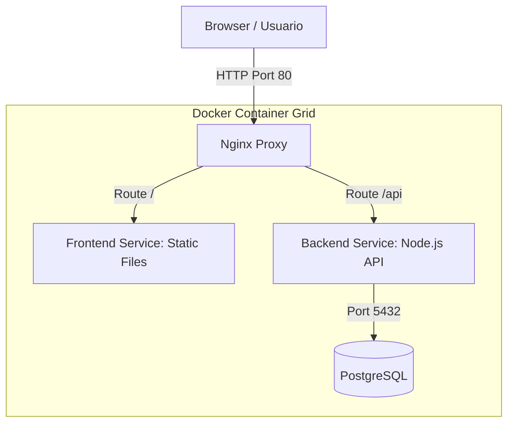

# 📝 Todo App Full-Stack

> Aplicación TODO moderna con arquitectura desacoplada, construida con **TypeScript**, **React**, **Express**, **PostgreSQL** y **TypeORM**.


---

## 📋 Tabla de Contenidos

- [Descripción General](#-descripción-general)
- [Arquitectura del Sistema](#-arquitectura-del-sistema)
- [Requisitos Previos](#-requisitos-previos)
- [Instalación y Configuración](#-instalación-y-configuración)
- [Ejecución con Docker (Recomendado)](#-ejecución-con-docker-recomendado)
- [Desarrollo Local](#-desarrollo-local)
- [Estructura del Repositorio](#-estructura-del-repositorio)
- [Networking y Puertos](#-networking-y-puertos)
- [Documentación Adicional](#-documentación-adicional)

---

## 🎯 Descripción General

Este proyecto es una aplicación de gestión de tareas (TODO) de nivel profesional. Implementa un backend robusto con persistencia en base de datos relacional y un frontend dinámico y reactivo.

**Estado actual:**

- ✅ **Backend**: API REST funcional con paginación real, búsqueda y tests.
- ✅ **Frontend**: Interfaz de usuario moderna con React, Tailwind v4 y Sidebar avanzado.
- ✅ **Dockerización**: Pipeline completo para desarrollo y despliegue local.
- ✅ **Base de Datos**: Gestión automatizada con TypeORM Migrations y Seeders técnicos.
- ✅ **Personalización**: Sistema multi-tema con 5 paletas de colores y modo oscuro/claro.

---

## ✨ Características Destacadas

### 📊 Gestión Avanzada de Datos
- **Paginación y Ordenación Real**: Procesa grandes volúmenes de datos directamente en el servidor.
- **Búsqueda Integrada**: Filtros técnicos que combinan estado, búsqueda de texto y ordenación (Fecha/A/Z).
- **Tareas vs Notas**: Distinción visual y funcional entre tareas accionables y notas informativas (estética "paper-like").

### 🎨 Sistema Multi-Tema
La aplicación incluye un sistema de personalización avanzado que permite cambiar la estética global instantáneamente:
- **5 Paletas de Colores**: Indigo (Clásico), Moss (Naturaleza), Charcoal (Minimalista), Punchy (Vibrante) y Milk (Cálido).
- **Modos Adaptativos**: Cada tema está optimizado tanto para Modo Claro como para Modo Oscuro.
- **Persistencia**: La elección del tema y modo se guarda localmente en el navegador.

### 🛠️ Herramientas de Desarrollo (DX)
- **Modo Desarrollo**: Dashboard flotante discreto para resetear y sembrar datos de prueba instantáneamente.
- **Seeder Técnico**: Genera 20+ entradas con fechas pasadas para probar la scanability temporal de la app.

## 🏗 Arquitectura del Sistema

La aplicación utiliza una arquitectura de microservicios orquestada por Docker Compose:



### Componentes Clave:

1.  **Frontend**: Aplicación SPA construida con Vite + React. En producción, se sirve a través de Nginx.
2.  **Backend**: Servidor Express en TypeScript. Maneja la lógica de negocio y la comunicación con el ORM.
3.  **Base de Datos**: PostgreSQL 15, persistida mediante volúmenes de Docker.
4.  **Reverse Proxy**: Nginx actúa como punto de entrada único, redirigiendo el tráfico según la ruta (`/` vs `/api`).

---

## 🔧 Requisitos Previos

- **Docker Desktop** (Altamente recomendado)
- **Node.js v18+** y **npm** (para desarrollo local sin Docker)
- **Git**

---

## 🚀 Ejecución con Docker (Recomendado)

Para levantar todo el ecosistema (Frontend, Backend, DB) con un solo comando:

```bash
# 1. Clonar el repositorio
git clone https://github.com/brianramirezdev/todo-app
cd todo-app

# 2. Levantar los servicios
docker compose up --build
```

> [!NOTE]
> Las migraciones de la base de datos se ejecutan automáticamente al iniciar el contenedor del backend.

### URLs de Acceso

| Servicio        | URL                                                    |
| :-------------- | :----------------------------------------------------- |
| **Frontend UI** | [http://localhost:80](http://localhost:80)             |
| **Backend API** | [http://localhost:3001/api](http://localhost:3001/api) |
| **DB Health**   | Check contenedor `todo-db`                             |

---

## 💻 Desarrollo Local

Si prefieres ejecutar los servicios de forma independiente:

### 1. Base de Datos

Necesitarás una instancia de PostgreSQL corriendo (puerto 5432, user/pass: `postgres`). Puedes usar la de Docker:

```bash
docker compose up -d postgres
```

### 2. Backend

```bash
cd backend
npm install
npm run migration:run
npm run dev
# El servidor iniciará en http://localhost:3000
```

### 3. Frontend

```bash
cd frontend
npm install
npm run dev
```

---

## 📁 Estructura del Repositorio

```text
todo-app/
├── backend/            # API REST (Node, Express, TypeORM)
│   ├── src/            # Código fuente
│   └── tests/          # Tests de integración JEST
├── frontend/           # UI (React, Vite, Tailwind v4)
│   ├── src/            # Componentes y Hooks
│   └── nginx.conf      # Configuración para el contenedor
├── docker-compose.yml  # Orquestación de servicios
└── README.md           # Documentación principal
```

---

## 🌐 Networking y Puertos

El proyecto utiliza una red interna de Docker llamada `todo-network`.

- **Internal Backend Port**: `3000`
- **Exposed Backend Port**: `3001` (para acceso directo a la API)
- **Exposed Frontend Port**: `80` (punto de entrada principal)
- **Postgres Port**: `5432`

---

## 📖 Documentación Adicional

Para detalles específicos de cada componente, consulta sus propios manuales:

- 🛠 [**Documentación del Backend**](./backend/README.md)
- 🎨 [**Documentación del Frontend**](./frontend/README.md)

---

## 🧠 Decisiones Técnicas y Mejoras Futuras

**Decisiones:**
Se optó por una **arquitectura desacoplada** (Client/Server) orquestada con **Docker** para garantizar consistencia entre desarrollo y producción. En el backend, la separación por capas (Rutas -> Controladores -> Servicios -> Entidades) facilita la escalabilidad y el testing. Para el frontend, el uso de **estados optimistas** y **Tailwind v4** prioriza una UX fluida y moderna, mientras que la paginación se delegó al servidor para optimizar el rendimiento con grandes volúmenes de datos.

**Mejoras Futuras:**
1.  **Autenticación y Multiusuario:** Implementar JWT para que cada usuario tenga sus propias listas privadas.
2.  **Testing E2E:** Añadir Cypress o Playwright para probar flujos completos de usuario crítico.
3.  **WebSockets:** Implementar Socket.io para colaboración en tiempo real entre múltiples pestañas/usuarios.
4.  **Categorías Personalizadas:** Permitir crear etiquetas dinámicas más allá de "Nota" y "Tarea".

---

## 📝 Licencia

MIT
