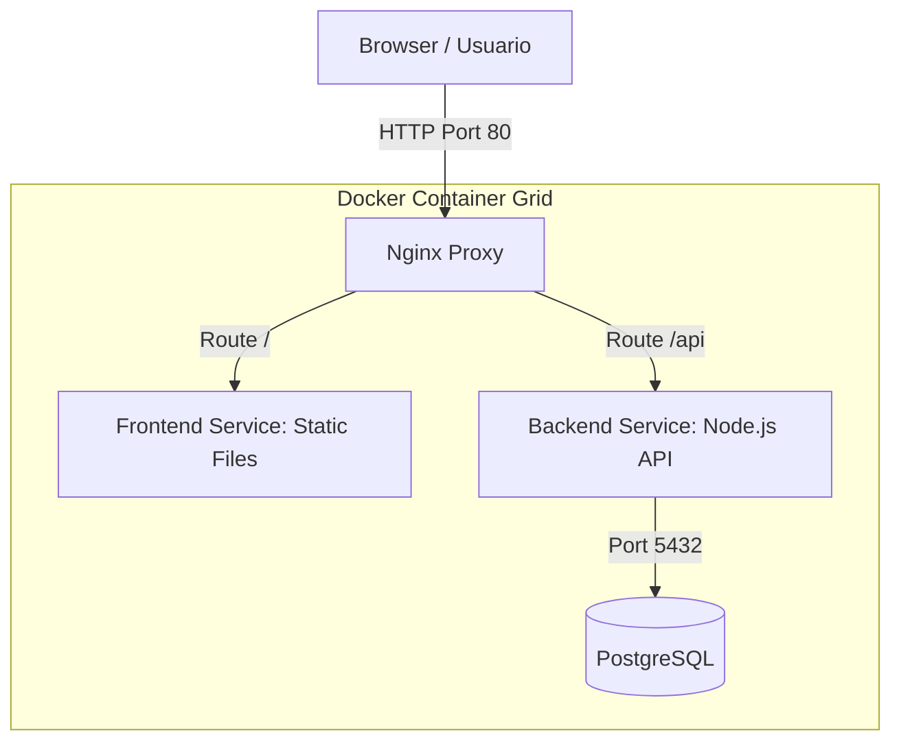

# 📝 Todo App Full-Stack

> Aplicación TODO moderna con arquitectura desacoplada, construida con **TypeScript**, **React**, **Express**, **PostgreSQL** y **TypeORM**.


---

## 📋 Tabla de Contenidos

- [Descripción General](#-descripción-general)
- [Arquitectura del Sistema](#-arquitectura-del-sistema)
- [Requisitos Previos](#-requisitos-previos)
- [Instalación y Configuración](#-instalación-y-configuración)
- [Ejecución con Docker (Recomendado)](#-ejecución-con-docker-recomendado)
- [Desarrollo Local](#-desarrollo-local)
- [Estructura del Repositorio](#-estructura-del-repositorio)
- [Networking y Puertos](#-networking-y-puertos)
- [Documentación Adicional](#-documentación-adicional)

---

## 🎯 Descripción General

Este proyecto es una aplicación de gestión de tareas (TODO) de nivel profesional. Implementa un backend robusto con persistencia en base de datos relacional y un frontend dinámico y reactivo.

**Estado actual:**

- ✅ **Backend**: API REST funcional con validaciones y tests.
- ✅ **Frontend**: Interfaz de usuario moderna con React y Tailwind v4.
- ✅ **Dockerización**: Pipeline completo para desarrollo y despliegue local.
- ✅ **Base de Datos**: Gestión automatizada con TypeORM Migrations.

---

## 🏗 Arquitectura del Sistema

La aplicación utiliza una arquitectura de microservicios orquestada por Docker Compose:



### Componentes Clave:

1.  **Frontend**: Aplicación SPA construida con Vite + React. En producción, se sirve a través de Nginx.
2.  **Backend**: Servidor Express en TypeScript. Maneja la lógica de negocio y la comunicación con el ORM.
3.  **Base de Datos**: PostgreSQL 15, persistida mediante volúmenes de Docker.
4.  **Reverse Proxy**: Nginx actúa como punto de entrada único, redirigiendo el tráfico según la ruta (`/` vs `/api`).

---

## 🔧 Requisitos Previos

- **Docker Desktop** (Altamente recomendado)
- **Node.js v18+** y **npm** (para desarrollo local sin Docker)
- **Git**

---

## 🚀 Ejecución con Docker (Recomendado)

Para levantar todo el ecosistema (Frontend, Backend, DB) con un solo comando:

```bash
# 1. Clonar el repositorio
git clone https://github.com/brianramirezdev/todo-app
cd todo-app

# 2. Levantar los servicios
docker compose up --build
```

> [!NOTE]
> Las migraciones de la base de datos se ejecutan automáticamente al iniciar el contenedor del backend.

### URLs de Acceso

| Servicio        | URL                                                    |
| :-------------- | :----------------------------------------------------- |
| **Frontend UI** | [http://localhost:80](http://localhost:80)             |
| **Backend API** | [http://localhost:3001/api](http://localhost:3001/api) |
| **DB Health**   | Check contenedor `todo-db`                             |

---

## 💻 Desarrollo Local

Si prefieres ejecutar los servicios de forma independiente:

### 1. Variables de Entorno

Copia el archivo `.env.example` a `.env` en la raíz y configura tus credenciales locales.

```bash
cp .env.example .env
```

### 2. Base de Datos

Necesitarás una instancia de PostgreSQL corriendo. Puedes usar solo la DB de Docker:

```bash
docker compose up -d postgres
```

### 3. Backend

```bash
cd backend
npm install
npm run migration:run
npm run dev
```

### 4. Frontend

```bash
cd frontend
npm install
npm run dev
```

---

## 📁 Estructura del Repositorio

```text
todo-app/
├── backend/            # API REST (Node, Express, TypeORM)
│   ├── src/            # Código fuente
│   └── tests/          # Tests de integración JEST
├── frontend/           # UI (React, Vite, Tailwind v4)
│   ├── src/            # Componentes y Hooks
│   └── nginx.conf      # Configuración para el contenedor
├── docker-compose.yml  # Orquestación de servicios
└── README.md           # Documentación principal
```

---

## 🌐 Networking y Puertos

El proyecto utiliza una red interna de Docker llamada `todo-network`.

- **Internal Backend Port**: `3000`
- **Exposed Backend Port**: `3001` (para acceso directo a la API)
- **Exposed Frontend Port**: `80` (punto de entrada principal)
- **Postgres Port**: `5432`

---

## 📖 Documentación Adicional

Para detalles específicos de cada componente, consulta sus propios manuales:

- 🛠 [**Documentación del Backend**](./backend/README.md)
- 🎨 [**Documentación del Frontend**](./frontend/README.md)

---

## 📝 Licencia

MIT
